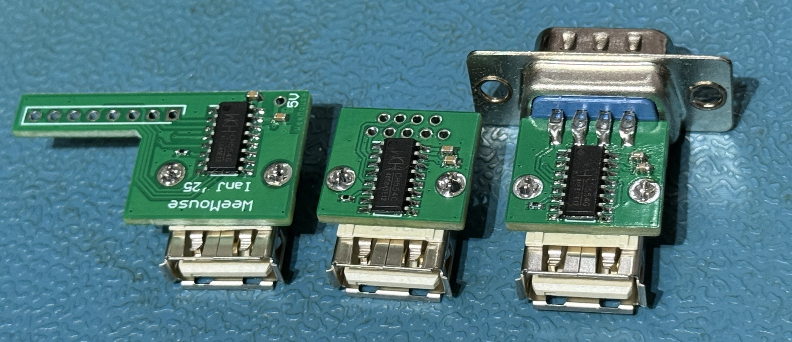

# WeeMouse

May 2025

My layout and tweaks to [jjmz's Atari Quadrature USB Mouse Adapter](https://github.com/jjmz/Atari-Quadrature-USB-Mouse-Adapter), tuned for use with Acorn machines.

The "A300A400" version is designed to sit directly on the back of an Archimedes A300/A400 (and A540/A5000...) keyboard, hanging out of the mouse port.  The addition of some BluTak or VHB tape is suggested for best mechanical support.

The A3000 internal version is designed to hide inside the A3000.  Beware that at present this means that the external mouse port will no longer be usable - I hope to update the firmware such that if there's no USB device connected, the mouse control pins are set high-Z so there's an easy way to change between the two.

The 'standard' version is designed to be wired to an off the shelf mini-DIN plug.  I find it almost impossible to wire such plugs, so this is a 'soap on a rope' kind of design - suited to RiscPC.

Finally, there's a version for the Master Compact.  This is set up as per the wiring that suits the Master Compact welcome disc.  There appear to be alternative wiring plans - notably JGHarston's "Mouse" ROM does not like this setup and mis-interprets the inputs.  I've not tested it much further than that.

I've designed some simple 3D-printable enclosures for the three 'external' versions (A300A400, standard, Compact) - designed to be as small as possible, so parts hold together with glue/double sided tape.  Solidworks source files and STEP output files are provided in this repo.

A version for the BBC/Master User port may come along eventually, but I'm not really an "8bit" person.

I also hope to be able to implement the same logic as per the STD PS2MouseMini, to support the mousewheel.  The STD wheel driver module for RISC OS 3 machines can be downloaded from the STD website, but it's actually built directly in to RISC OS 4.39 and I really love the PS2MouseMini because of that.

[More photos](Photos/)

[3D printable enclosures](Enclosures/)

[PCB Gerbers and firmware binary](Generated/)

## Licence

No warranty is provided, and this work is used at your own risk.

Licenced as CC BY-SA 4.0

Copyright 2025 Ian Jeffray
